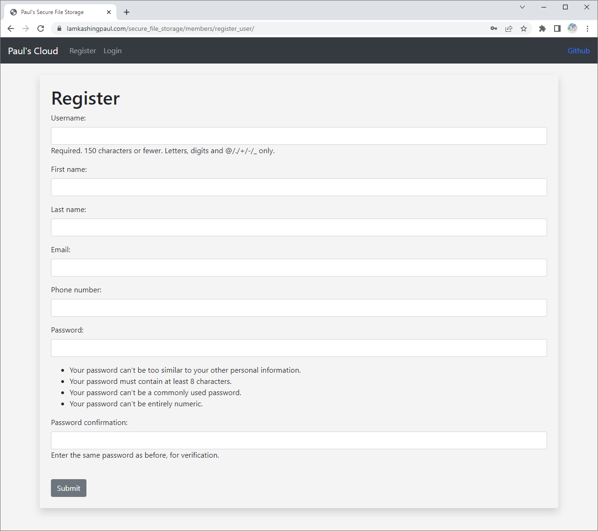
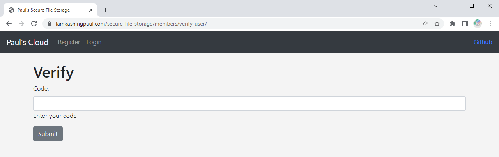
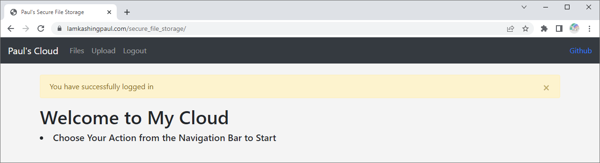
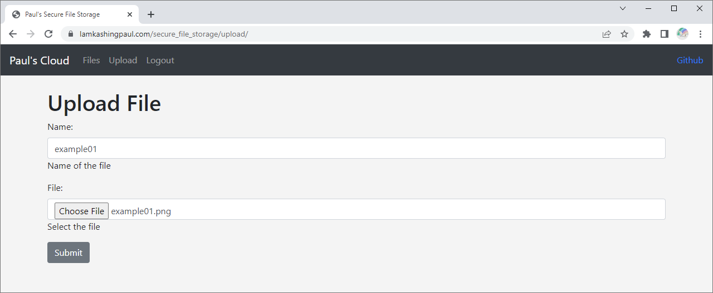
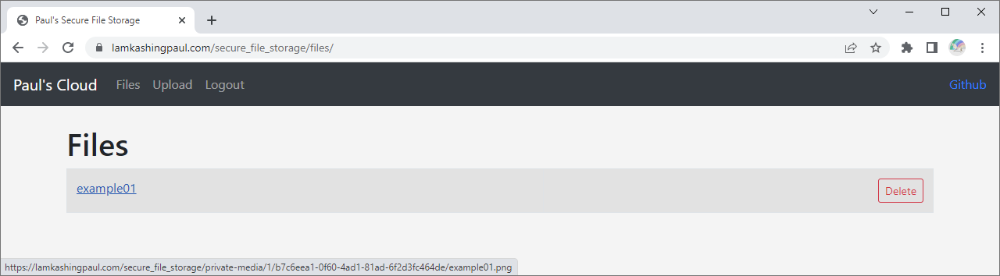

# Secure File Storage Project for Course IERG4350

This is a mini project for the course IERG4350 Cloud Computing Security.

A file storage application is implemented using Django, and it is secured using Django authentication system.

2FA (which is the SMS Authentication provided by [Twilio](https://www.twilio.com/docs/usage/api)) is added during the login process.

# Project Homepage

https://lamkashingpaul.com/secure_file_storage/

# Homepage Captures
## Register Page

## Verify Page

## Home Page

## Upload Page

## Files Page

